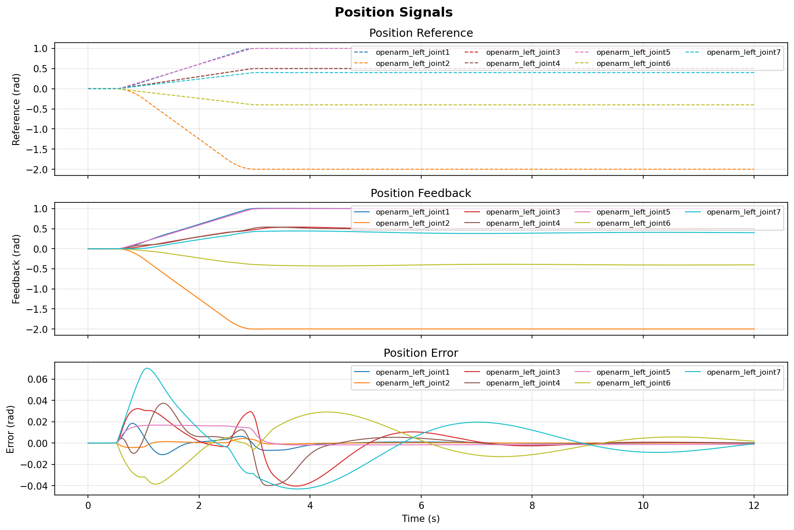
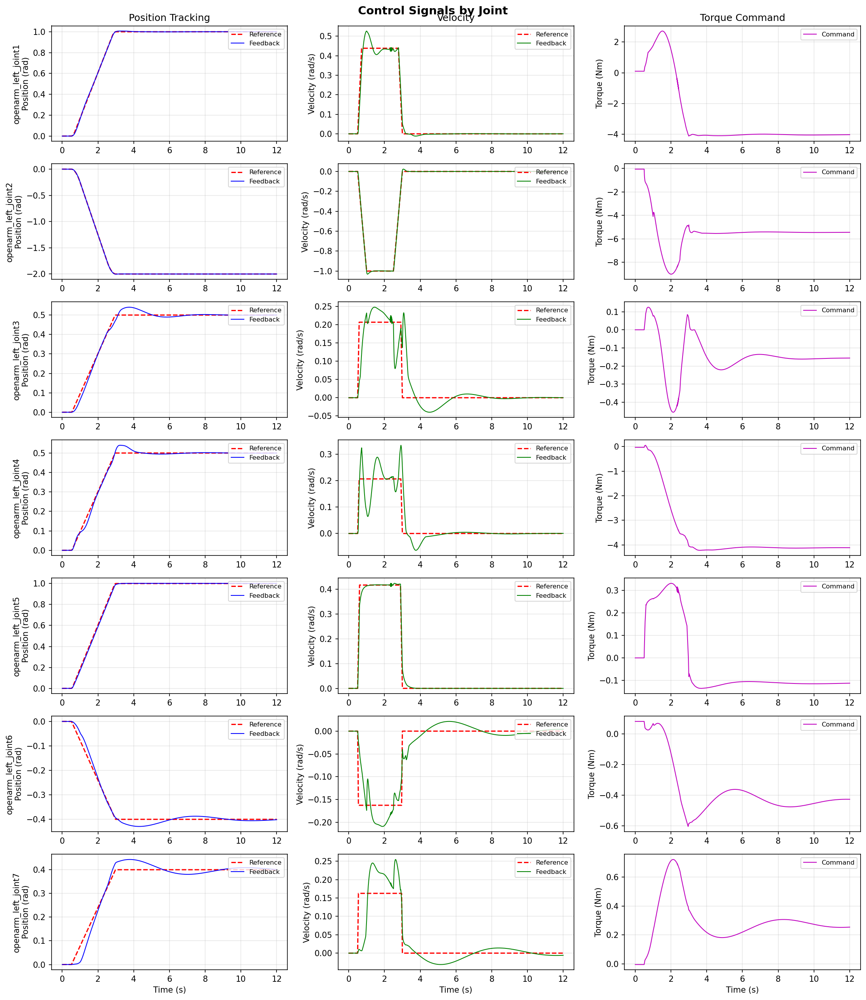
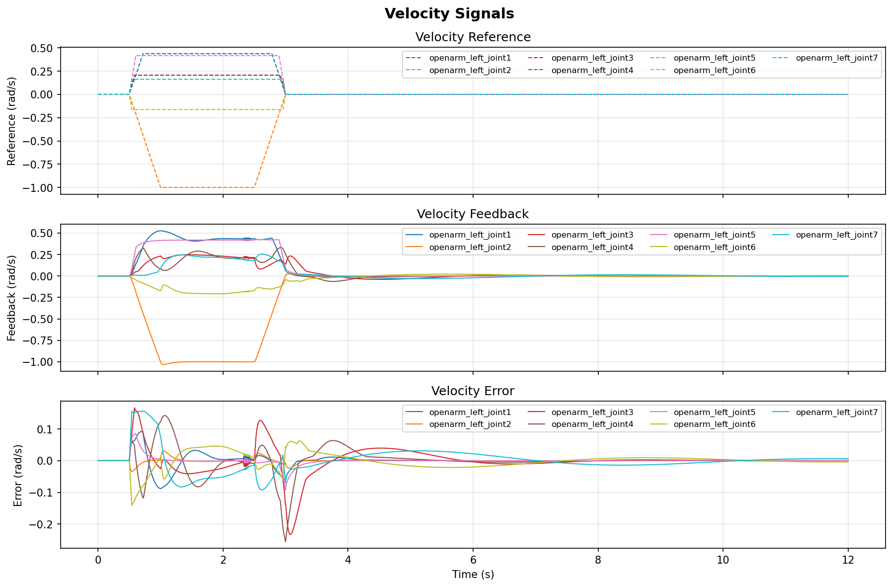
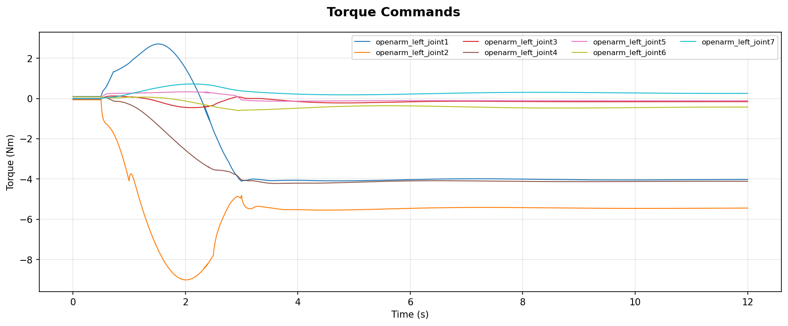

# openarm_control

Cascaded joint-space control for the **OpenArm v1** bimanual manipulator in
MuJoCo: a position→velocity→torque loop with model-based gravity compensation,
plus an observer/plotter layer for control-signal analysis.

Seven degrees of freedom per arm, torque-level actuation. The same gravity
model serves both the simulation path and a CAN hardware path.


*Both arms driving a five-waypoint tour, replayed at ~5x. Each leg is a
time-synchronised trapezoidal profile; the arms run the same pose list
phase-shifted, with joints 1 and 2 mirrored. Worst-case final joint error
across all waypoints and both arms: **0.040 rad**.*

Regenerate with:

```bash
cd scripts && MUJOCO_GL=glfw python3 make_gif.py --dwell 2.0
```

---

## Control architecture

Two nested PID loops. The outer loop converts position error into a velocity
setpoint; the inner loop converts velocity error into a joint torque, with
model-computed gravity torques injected as feedforward.

```
              ┌───────────────────────┐
   q_ref ───► │  Position PID         │ ──► q̇_cmd ──┐
        ▲     │  kp, ki, kd           │             │
        │     └───────────────────────┘             ▼
        │                                          (+) ◄── q̇_ref
        │                                           │
        │                            ┌──────────────┴──────────┐
        │                            │  Velocity PID           │
        │                     q̇_fb ─►│  + τ_gravity (feedfwd)  │ ──► τ_cmd
        │                            └─────────────────────────┘
        │                                           │
        │                                           ▼
        │                              ┌─────────────────────────┐
        └───────── q_fb ───────────────┤  MuJoCo plant           │
                   q̇_fb ───────────────┤  mj_step, IMPLICITFAST  │
                                       └─────────────────────────┘
                                                    │
                                                    ▼
                                          Observer ──► SignalPlotter
```

**Gravity compensation.** Torques come from MuJoCo's `qfrc_bias`, evaluated at
the current configuration with `qvel` forced to zero — so the bias term reduces
to pure gravity with no Coriolis or centrifugal contribution. It is computed
against the same MJCF that drives the plant, which makes it exact in simulation
and a model-accuracy question on hardware.

**Solver settings.** The simulation forces `mjINT_IMPLICITFAST` with a small
timestep. Euler integration at high `kp` amplifies joint stiffness and produces
spurious oscillation; the implicit velocity integrator adds implicit damping
that keeps stiff joints stable without detuning the controller.

---

## Repository layout

| Path | Purpose |
|---|---|
| `scripts/mujoco_sim.py` | Simulation driver: model loading, control loop, headless `go_to_motor_angles`, viewer replay, CLI |
| `scripts/controller_impl.py` | `PID_Controller` dataclass, `ControllerData` state, `FF_Controllers.FF_PID_controller` with anti-windup |
| `scripts/gravity_compensation.py` | `GravityCompensationSim` (MuJoCo) and `GravityCompensation` (CAN hardware) |
| `scripts/observer.py` | Time-series recorder for reference/feedback/torque; `.npz` save and load |
| `scripts/plotter.py` | `SignalPlotter` — per-joint and per-signal figures with error traces |
| `scripts/config/sim_config.yaml` | Gains and output limits for both loops |
| `models/openarm_mujoco/` | Submodule — `enactic/openarm_mujoco` MJCF |
| `modules/ruckig/` | Submodule — `pantor/ruckig`, not yet wired in |

---

## Configuration

All gains live in `scripts/config/sim_config.yaml`; nothing is hardcoded in the
control path.

```yaml
dt: 0.1                       # controller sampling interval — see Known issues

position_controller:          # outputs a velocity setpoint
  kp:      [10, 10., 3., 10.1, 5., 15.0, 5.0]
  ki:      [5.0, 0.0, 1.0, 4.0, 0.0, 9.1, 0.0]
  kd:      [0.0, 2., 0.0, 0.0, 3.0, 0.0, 0.0]
  max_lim: [...]
  min_lim: [...]

velocity_controller:          # outputs a torque command
  kp:      [100.0, 100., 10.0, 2.0, 5.0, 14.55, 2.55]
  ki:      [0.0, 0.0, 0.0, 0.2, 1.0, 2.0, 1.0]
  kd:      [0.0, 0.0, 0.0, 0.1, 0.0, 2., 0.5]
  kgc:     [1.0, ...]         # gravity feedforward scaling
  max_lim: [40, 40, 27, 27, 7, 7, 7]        # torque limits (Nm)
  min_lim: [-40, -40, -27, -27, -7, -7, -7]
```

Torque limits reflect the physical actuators: **DM8009** on joints 1–2,
**DM4340** on joints 3–4, **DM4310** on joints 5–7.

---

## Installation

```bash
git clone --recurse-submodules https://github.com/dt1729/openarm_control.git
cd openarm_control
pip install mujoco numpy pyyaml matplotlib
```

Already cloned without submodules:

```bash
git submodule update --init --recursive
```

---

## Running

```bash
cd scripts

# Default demo: drive the left arm to a fixed pose, then replay and plot
python mujoco_sim.py

python mujoco_sim.py --arm_side right_arm    # choose an arm
python mujoco_sim.py --no-replay             # skip the 3D replay
python mujoco_sim.py --log-level DEBUG       # full control-loop trace

python mujoco_sim.py \
  --model_path ../models/openarm_mujoco/v1/openarm_bimanual.xml \
  --config config/sim_config.yaml
```

`Q` in the viewer or `Ctrl+C` in the terminal exits cleanly.

### Programmatic use

```python
from mujoco_sim import MuJoCoSimulation
import numpy as np

sim = MuJoCoSimulation(model_path=..., config_path=..., arm_side="left_arm")
sim.go_to_motor_angles(np.array([1.0, -2.0, 0.5, 0.5, 1.0, -0.4, 0.4]), timeout=30.0)

sim.save_data("run.npz")          # persist the trace
sim.visualize(save_dir="plots")   # write figures
sim.replay_in_viewer(playback_speed=2.0)
```

---

## Analysis output

`SignalPlotter` produces two layouts from a recorded run. All figures below are
one 12 s step of the left arm to
`[1.0, -2.0, 0.5, 0.5, 1.0, -0.4, 0.4]` rad, regenerated with:

```bash
cd scripts && python3 make_plots.py       # writes docs/plots/
```

### By signal — reference, feedback and error across all joints



The trapezoidal profile is visible directly in the top panel: a 0.5 s settle
hold, then every joint ramps and **arrives together at ~2.9 s** regardless of
how far it had to travel — that is the time-synchronisation. Joint 2 covers
2.0 rad and joint 6 covers 0.4 rad, and both finish at the same instant.

The bottom panel is the one that matters. Tracking error stays inside
**±0.07 rad** through the whole move and decays to under 0.002 rad. The
residual wobble between 4 s and 10 s is the last of the settle, not a limit
cycle — it decreases monotonically.

### By joint — position, velocity and torque per joint



One row per joint. Left column is position reference (dashed) against feedback
(solid), middle is velocity, right is the commanded torque. Useful when a
single joint misbehaves: this is the view that isolated joint 5's limit cycle
to its velocity loop rather than anything global.

<details>
<summary>Velocity and torque signals</summary>




Torque stays well inside the actuator limits (−9.0 to +2.7 Nm against a ±40 Nm
bound on joint 1), which is what gravity feedforward buys — the loops only have
to supply the dynamics, not hold the arm up.

</details>

Traces persist to `.npz` through `Observer.save()` and reload with
`Observer.load()`, so tuning runs can be compared offline without re-simulating.

---

## Hardware path

`GravityCompensation` targets the physical arm through `openarm_can`: it
initialises the seven motors with their type and send/receive CAN IDs, enables
them, then loops reading joint positions, computing gravity torques from the
MuJoCo model, and issuing MIT-mode torque commands. The import is currently
commented out, so this path is inactive until `openarm_can` is installed.

---

## Defects found and fixed

Recorded rather than hidden: the current gains depend on these fixes, so anyone
re-tuning needs the history.

1. **Gravity compensation corrupted the simulation state.** *(dominant)*
   `GravityCompensationSim.compute_gravity_torques` received the live `MjData`
   and executed `self.data.qvel[:] = 0` to isolate gravity from the Coriolis
   terms in `qfrc_bias` — erasing the arm's velocity on every control step,
   immediately before `mj_step`. The solve now runs on a private scratch buffer.
2. **`dt` mismatch.** The config declared `dt: 0.1` while the code forced
   `timestep = 1e-4` — a 1000x discrepancy in every integral and derivative
   term. The timestep now comes from the config, and the controller uses it.
3. **Unit mismatch on the outer loop.** The position controller emits a velocity
   setpoint but was clamped to joint *angle* limits in radians. Its limits are
   now joint velocity limits in rad/s.
4. **No trajectory generation.** `go_to_motor_angles` applied the target as a
   step, which saturates the actuators regardless of tuning. Moves are now
   driven by a time-synchronised trapezoidal profile (`trajectory.py`) whose
   velocity feeds the previously-unused `vel_state._ref` feedforward input.
   This change alone took saturation from 95% to 14%.

### Validation

Step to `[1.0, -2.0, 0.5, 0.5, 1.0, -0.4, 0.4]` rad on the left arm
(`scripts/harness.py`):

| | Before | After |
|---|---:|---:|
| Max final joint error | 1.81 rad | **0.000 rad** |
| Torque saturation | 88% of run | **0%** |
| Residual velocity at rest | 0.65 rad/s | **0.000 rad/s** |
| Peak commanded torque | ±40 Nm (at limit) | −9.0 … +2.7 Nm |

### Gain sizing

Measured effective joint inertia spans **446x** from shoulder to wrist
(0.461 down to 0.0010 kg m²), so no uniform gain profile can be stable across
all seven joints. `autogain.py` measures inertia by applying a unit torque and
reading the resulting acceleration, then sets `kp = M_eff / tau_v` with
`tau_v = 0.02 s`, and `ki = kp / 0.2`.

Reproduce with `python3 harness.py`; sweep with `python3 tune.py`; re-derive
gains with `python3 autogain.py`.

---

## Roadmap

- Swap the trapezoidal profile for the `ruckig` submodule (jerk-limited, online)
- Re-enable and validate the `openarm_can` hardware path
- Cartesian-space control layered on the existing joint loop
- Multi-waypoint sequencing, so moves can be staged rather than fully overlapped

---

## References

- [enactic/openarm_mujoco](https://github.com/enactic/openarm_mujoco) — MJCF model
- [pantor/ruckig](https://github.com/pantor/ruckig) — jerk-limited trajectory generation
- [MuJoCo documentation](https://mujoco.readthedocs.io/) — `qfrc_bias`, integrator selection
